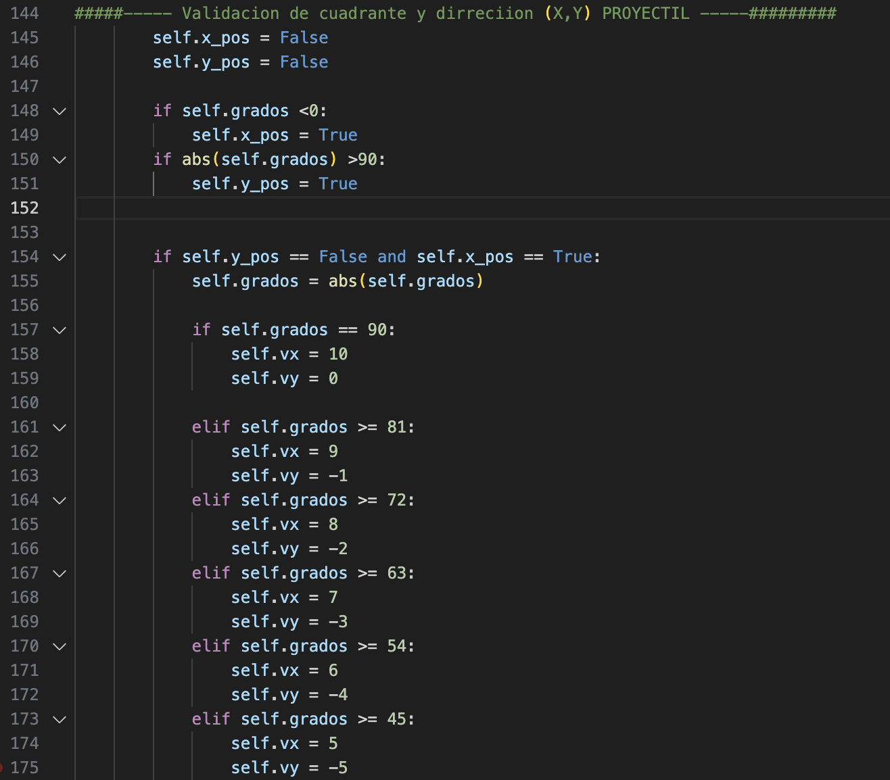

# Juego Asteroids programado en python

> ### librerias necesarias para ejecutar
>
> - Pygame
> - sys
> - random
> - math
>
>  #### comandos para instalar librerias: `pip install pygame`

## Futuras mejoras del juego

La validacion de la ubicacion del cursor poco recursiva y repeticion de codigo inicesaria.